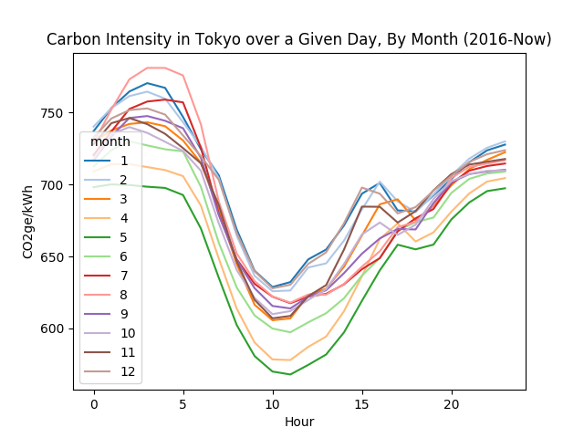

# japan_grid_carbon_api

API and Backend to Calculate the Current Carbon Intensity of the Japanese Grid...roughly

## Work so far:

- Pipeline for Extracting and Formatting TEPCO, Tohokuden and KEPCO Data
- Combined and extensible endpoint using Flask routing
- Added Pytest Tests
- Implementation of the [Serverless](https://www.serverless.com/) deployment framework
- Basic Website Built [Repo](https://github.com/FraserTooth/japan_grid_carbon_api_website)

## Planned Work:

- Make carbon intensity value data available in the form of an API, based on averaging historic data
- Combine Weather Data and Historic Data with ML to make forecast about 'likely current intensity'
- Allow historic query on predictions
- Incorporate all regions in Japan
- Build Good Documentation for the API
- Solve the 'Pumped Storage' Problem 👇

### Pumped Storage Problem

My initial assumption was that the Pumped Storage carbon intensity factor would be 0 gC02/kWh, like it is in the UK. This assumption was based in the idea that one would only 'charge' the pumped storage when there was renewable electricity available to charge it. Since, at least in the UK, renewable energy is considered 'spare' then all the 'spare power' goes into charging to storage.  
**However**, some digging showed that for the TEPCO region, from 2014-2020, for >2500 datapoints, pumped storage was 'charged' when there was _not_ enough renewable energy to fill it. The vast majority of these occasions were overnight (1AM - 5AM), where assumably the charging was done to ensure resiliance for the next day.  
This poses a challenge, we now know that the Electricity in Pumped storage is not carbon neutral. And in order to model the Carbon inside the pumped storage for a given hour, we will have to look at the historical behaviour of the asset and figure out how much non-renewable power has gone into storage.  
In the meantime, we can use a small average figure for the Carbon Intensity, but it would be good to get a more accurate result.

## Data Sources

Data has been retrived from:

- TEPCO: [Source Link](http://www.tepco.co.jp/forecast/html/area_data-j.html)
- Tohokuden: [Source Link](https://setsuden.nw.tohoku-epco.co.jp/download.html)
- KEPCO: [Source Link](https://www.kansai-td.co.jp/denkiyoho/area-performance.html)

Example Graphs So Far:

>   
> _An Early Carbon Intensity Graph, this is the average amount of Carbon Emitted in Tokyo for every unit of electricity used, for all hours of the day, for each month of the year.  
> Derived from Public TEPCO Data_

### Useful Functions Snippets

```bash
# Open Virtual Environment
source .venv/bin/activate

# Read the Recent Logs
gcloud functions logs read

# Deploy Endpoint
./deployendpoint.sh daily_carbon_intensity

# Run Locally
./local.sh api main

# Deploy All
./deployAll.sh

# Run Tests
pytest -vv

# PIP Freeze with Line to Get Around pkg-resources==0.0.0 bug in Linux
pip freeze | grep -v "pkg-resources" > requirements.txt
```

### Links Used when calculating the Carbon Intensities in Japan

- https://www.fepc.or.jp/about_us/pr/pdf/kaiken_s_e_20170616.pdf
- https://e-lcs.jp/news/detail/000208.html
- https://www.jepic.or.jp/pub/pdf/epijJepic2019.pdf
- https://www.fepc.or.jp/english/library/electricity_eview_japan/__icsFiles/afieldfile/2016/08/24/2016ERJ_full.pdf
